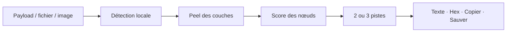
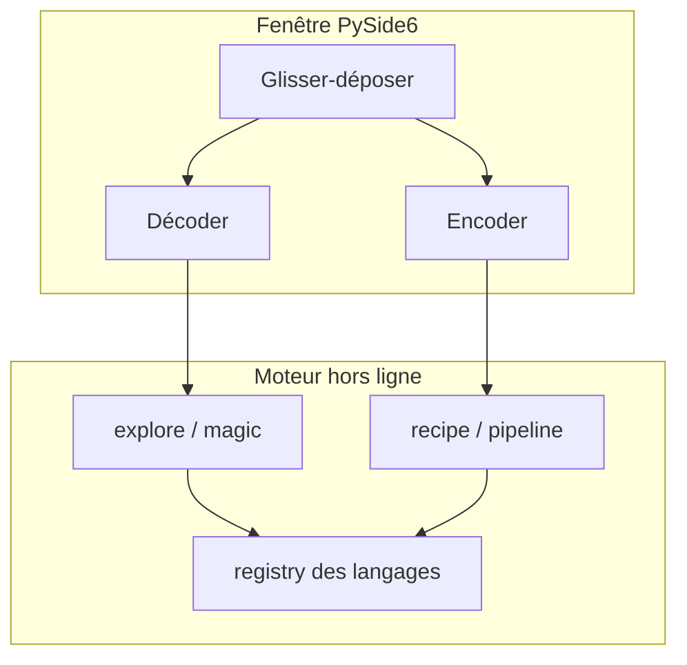

# Cascade

<p align="center">
  
</p>

<p align="center"><strong>Cascade</strong> est un décodeur / encodeur de bureau.<br>
Tu colles un payload, tu glisses un fichier, ou tu empiles des langages.<br>
Tout reste sur la machine : pas de cloud, pas d’historique, pas de base.</p>

---

## Deux visages

<p align="center">
  
</p>

| | **Décoder** | **Encoder** |
| --- | --- | --- |
| Couleur | Cyan | Corail |
| Idée | Auto déroule les couches | Toi tu empiles à la main |
| Entrée | Payload, fichier, image | Message clair |
| Sortie | 2 ou 3 pistes classées | Pipeline exact |

---

## Comment Auto travaille

<p align="center">
  
</p>



Les hashes (MD5, SHA-1, SHA-256, SHA-512) sont **à sens unique** : Auto les identifie, il ne les inverse pas.

---

## Langages

<p align="center">
  
</p>

<details>
<summary>Liste complète</summary>

| Famille | Opérations |
| --- | --- |
| Encodages | Base64, Base32, Base32hex, Base58, Base85 / Ascii85, hex, décimal, binaire, Morse, URL, UU, zlib, UTF-16 LE/BE, Latin-1, quoted-printable, entités HTML, échappements Unicode |
| Permutations | ROT13, ROT-N, ROT47, Atbash, reverse |
| Chiffres | César (brute), Vigenère, XOR (clé, brute 1–3 octets, wordlist) |
| Crypto | AES, DES, 3DES, RC4 |
| Images | QR, LSB |
| CTF / web | JWT, PowerShell encoded, `atob`, JS beautify |
| Sens unique | MD5, SHA-1, SHA-256, SHA-512 |

</details>

---

## Architecture



Rien n’est persisté. Fermer la fenêtre, c’est tout oublier.

<p align="center">
  
</p>

---

## Lancer

### Windows — un seul fichier

Copie `Cascade.exe` (Bureau ou `dist\`) où tu veux. Double-clic. Pas de Python.

> Premier lancement un peu plus long. SmartScreen peut demander *Informations complémentaires → Exécuter quand même* (l’exe n’est pas signé).

Pour le régénérer après une modification :

```powershell
powershell -ExecutionPolicy Bypass -File packaging\build-windows.ps1
```

### Windows — depuis le code

Double-clic sur `Cascade.bat`. Le premier lancement crée le venv.

### Debian — depuis le code

```bash
sudo apt install libxcb-cursor0 libegl1   # une fois
bash cascade.sh
```

Le `.deb` se construit **sur Debian** :

```bash
bash packaging/build-debian.sh
```

---

## Développement

```text
decoder/
├── src/cascade/          # app, UI, moteur
├── tests/                # régressions Auto + encodages
├── packaging/            # PyInstaller + Debian
├── docs/                 # visuels du README
├── Cascade.bat           # lancement Windows
└── cascade.sh            # lancement Debian
```

```powershell
python -m venv .venv
.\.venv\Scripts\pip install -e ".[dev]"
$env:PYTHONPATH = "src"
.\.venv\Scripts\pytest
```

```bash
python3 -m venv .venv
.venv/bin/pip install -e ".[dev]"
PYTHONPATH=src .venv/bin/pytest
```

Python **3.11+** (le build Windows actuel tourne en 3.14). Dépendances runtime : PySide6, pycryptodome, Pillow, opencv-python-headless, numpy.

---

<p align="center">
  <sub>Cascade · hors ligne · mémoire vive uniquement</sub>
</p>
